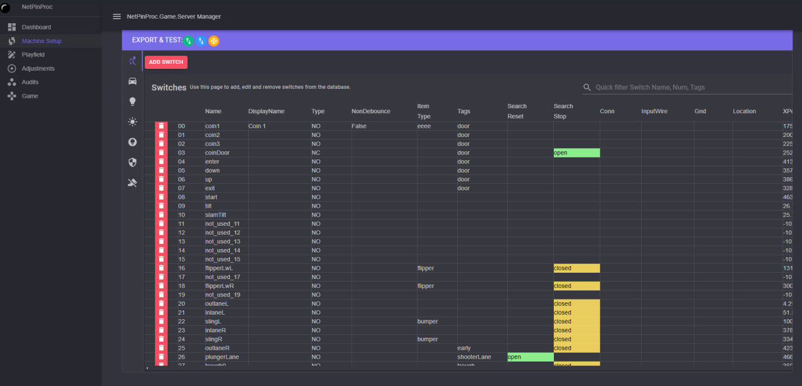

# NetPinProc

- [NetPinProc.Domain](NetPinProc.Domain) = Classes, interfaces and helpers with no 3rd party dependencies.
- [NetPinProc](NetPinProc) = Files for a physical PROC Device board. Uses the Domain library for `IProcDevice`
- [NetPinProc.Dmd](NetPinProc.Dmd) = Mostly for use when using a PROC Dmd controller on an existing machine
- [NetPinProc.Game](NetPinProc.Game) = Base game implementations for a `IGameController`
- [NetPinProc.Game.Sqlite](NetPinProc.Game.Sqlite) = Database Sqlite version of `IGameController` building off the `NetPinProc.Game`
- [NetPinProc.Ports.WSLED](NetPinProc.Ports.WSLED) = Serial LED drivers

These projects are also on nuget as packages, see `Using these NetPinProc Nuget Packages` below.

## Tools
- [NetPinProc.Game.Server](Tools\NetPinProc.Game.Server) - Manages the database & pinball machine with a client web application.
You can run this locally while developing or serve from your pinball machine. Builds can be found in releases.

## Tests
See testing examples for how to test and write your own methods

- [NetPinProc.Tests](.tests/NetPinProc.Tests) - Xunit tests
- [NetPinProc.Game.Tests](.tests/NetPinProc.Game.Tests) - Xunit tests
- [NetPinProc.Game.Sqlite.Tests](.tests/NetPinProc.Game.Sqlite.Tests) - Xunit tests

## Examples
- [.examples](.examples) - P-ROC and P3-ROC console applications

### Using these NetPinProc Nuget Packages
- Create a personal Github token under `settings > developer settings > classic token`. Set the token so it has read access to packages from Github
- Add a nuget source on your machine or in a project adding the url `https://nuget.pkg.github.com/FlippingFlips/index.json`
- The password for the source is the token you created and copied.